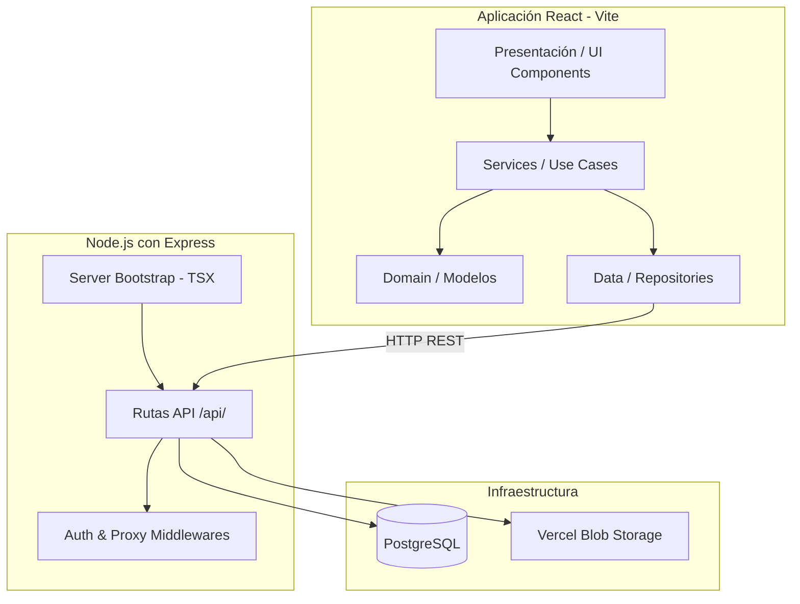

# Arquitectura del Sistema

Este documento describe la arquitectura de software empleada en el proyecto Koneksi Autoenrolamiento.

## Estilo Arquitectónico

El sistema utiliza **Clean Architecture** (Arquitectura Limpia) en conjunto con un diseño enfocado en la separación de responsabilidades entre el Frontend y el Backend, pero mantenidos dentro del mismo repositorio (Monorepo ligero).

- **Frontend:** Aplicación de Página Única (SPA) construida con React y empaquetada con Vite. Sigue principios de Clean Architecture alojando la lógica en `src/domain`, `src/data`, `src/presentation` y `src/services`.
- **Backend:** API REST desarrollada en Node.js con Express (`src/server/index.ts` y controladores en `api/`).
- **Base de Datos:** PostgreSQL para persistencia relacional (`database/`).

## Flujo de Datos

1. El usuario interactúa con la **Capa de Presentación** (`src/presentation`).
2. Las acciones de la UI invocan casos de uso en la **Capa de Dominio** (`src/domain` / `src/services`).
3. La capa de Dominio utiliza la **Capa de Datos** (`src/data`) para comunicarse de forma asíncrona con el backend a través de protocolos HTTP/REST.
4. El **Backend (Express API)** recibe las peticiones, procesa lógica de negocio, valida (usando JWT/Bcrypt) y persiste o recupera datos desde **PostgreSQL** (`database/`).

## Diagrama de Componentes

