# Arquitectura y Diccionario de Datos (koneksi_autoenroll)

Este documento centraliza la arquitectura relacional, el diccionario de datos y el esquema físico implementado en la base de datos PostgreSQL, específicamente dentro del esquema `koneksi_autoenroll`.

El esquema fue diseñado para soportar el flujo progresivo y dinámico del autoenrolamiento de prestadores médicos, adoptando un enfoque híbrido transaccional (uso de estructuras `JSONB` integradas con tablas relacionales de catálogo).

---

## Diagrama Entidad-Relación (ERD)

A continuación, la topología relacional extraída directamente de los objetos creados en la base de datos:

```mermaid
erDiagram
    doctor_enrollment_requests ||--o{ enrollment_request_status_history : "Registra historial de"
    
    %% Tablas Dimensionales y de Catálogo
    medical_specialties {
        varchar slug PK "Ej: cardiologia"
        varchar fallback_name "Nombre legible en UI (UNIQUE)"
        boolean enabled "Visible/Oculto"
        timestamp created_at "Fecha registro"
        varchar created_by "Autor"
        timestamp updated_at "Fecha actualización"
        varchar updated_by "Autor actualización"
    }

    team_roles {
        varchar code PK "Ej: ASISTENTE_GENERAL"
        varchar name "Nombre legible"
        boolean is_active "Estado"
        timestamp created_at "Fecha registro"
    }

    health_insurances {
        varchar code PK "Ej: SENASA"
        varchar name "Nombre de la ARS"
        boolean is_active "Estado"
    }

    medical_centers {
        bigint id PK
        varchar province "Provincia"
        varchar name "Nombre Institucional"
        varchar address "Dirección física"
        varchar phone "Teléfono"
        varchar city "Municipio"
        varchar sector "Sector/Barrio"
        uuid uuid "ID Desacoplado opcional"
    }

    user_roles {
        varchar code PK "Rol administrativo"
        varchar name "Nombre del rol"
        text description "Descripción"
        timestamp created_at "Fecha registro"
    }

    users {
        varchar email PK "Identificador y correo del usuario"
        varchar full_name "Nombre completo"
        timestamp created_at "Fecha registro"
    }

    %% Tablas Transaccionales
    otps {
        uuid id PK
        varchar identifier "Correo/Teléfono (Indexado)"
        varchar code "Token corto (String)"
        timestamp created_at "Generación"
        timestamp expires_at "Expiración"
        boolean verified "Ha sido validado"
    }

    doctor_enrollment_requests {
        uuid id PK "ID autonumérico"
        varchar status "PENDING_CONFIRMATION, OBSERVED, CONFIRMED, REJECTED, CORRECTED"
        varchar identification_number "Cédula / Pasaporte"
        varchar full_name "Nombre Titular"
        varchar medical_license "Exequátur"
        varchar registration_date "Fecha Exequátur"
        jsonb specialties "Arr: Slugs de Especialidad"
        varchar email "Correo Contacto"
        boolean email_verified "Validado por OTP"
        varchar phone "Celular"
        text biometric_image "Imagen biométrica temporal"
        jsonb team_members "Arr: Miembros del equipo"
        jsonb medical_centers "Arr: IDs/Datos centros"
        jsonb ars_providers "Arr: Códigos ARS"
        timestamp created_at "Inicio Draft"
        timestamp updated_at "Última Actualización"
        text biometric_image_url "URL Foto Definitiva en Nube"
    }

    enrollment_request_status_history {
        uuid id PK
        uuid request_id FK "Ref: doctor_enrollment_requests"
        varchar status "Nuevo Estado"
        varchar changed_by_email "Agente del cambio"
        timestamp changed_at "Momento del cambio"
    }
```

---

## Diccionario de Datos

### 1. `koneksi_autoenroll.doctor_enrollment_requests`
Tabla transaccional que almacena el progreso y la data final de las solicitudes de enrolamiento. Los datos múltiples (centros, especialidades) se guardan en estructuras `JSONB`.

| Columna | Tipo de Dato | Nulo | Por Defecto / Restricciones |
| :--- | :--- | :---: | :--- |
| `id` | `uuid` | No | `uuid_generate_v4()` (PK) |
| `status` | `varchar(30)` | No | `'PENDING_CONFIRMATION'`. Restringido vía `CHECK (status IN ('PENDING_CONFIRMATION', 'OBSERVED', 'CONFIRMED', 'REJECTED', 'CORRECTED'))` |
| `identification_number` | `varchar(20)`| Sí | Documento de identidad. |
| `full_name` | `varchar(200)`| Sí | Nombre completo del especialista. |
| `medical_license` | `varchar(50)` | Sí | Registro/exequátur médico. |
| `registration_date` | `varchar(20)` | Sí | Fecha asociada al exequátur. |
| `specialties` | `jsonb` | Sí | `'[]'` (Default) - Array conteniendo slugs de especialidad. |
| `email` | `varchar(150)`| Sí | Correo de registro. |
| `email_verified` | `boolean` | Sí | `false` (Default) |
| `phone` | `varchar(30)` | Sí | Teléfono de contacto. |
| `biometric_image` | `text` | Sí | Metadata biológica directa (por ejemplo, string b64 temporal). |
| `team_members` | `jsonb` | Sí | `'[]'` (Default) |
| `medical_centers` | `jsonb` | Sí | `'[]'` (Default) |
| `ars_providers` | `jsonb` | Sí | `'[]'` (Default) |
| `created_at` | `timestamp` | Sí | `now()` At Time Zone 'America/Santo_Domingo' |
| `updated_at` | `timestamp` | Sí | `now()` At Time Zone 'America/Santo_Domingo' |
| `biometric_image_url` | `text` | Sí | Referencia al archivo en proveedor Cloud (Vercel Blob). |

### 2. `koneksi_autoenroll.enrollment_request_status_history`
Registro tipo auditoría para trazar los cambios de vida de `status` de cada solicitud de alta.

| Columna | Tipo de Dato | Nulo | Por Defecto / Restricciones |
| :--- | :--- | :---: | :--- |
| `id` | `uuid` | No | `uuid_generate_v4()` (PK) |
| `request_id` | `uuid` | No | FK referenciando a `doctor_enrollment_requests` (`ON DELETE CASCADE`) |
| `status` | `varchar(30)` | No | Estado aplicado en el momento de la transición. |
| `changed_by_email` | `varchar(150)`| No | Identificador del actuante (ej. administrador o email del usuario). |
| `changed_at` | `timestamp` | Sí | `now()` At Time Zone 'America/Santo_Domingo' |

### 3. `koneksi_autoenroll.medical_centers`
Directorio de instituciones médicas y clínicas habilitadas para el enrolamiento nacional.

| Columna | Tipo de Dato | Nulo | Por Defecto / Restricciones |
| :--- | :--- | :---: | :--- |
| `id` | `bigint` | No | Secuencia autoincremental (`medical_centers_id_seq`) (PK) |
| `province` | `varchar(50)` | No | Forma parte del `UNIQUE CONSTRAINT` |
| `name` | `varchar(150)`| No | Forma parte del `UNIQUE CONSTRAINT` |
| `address` | `varchar(150)`| No | Forma parte del `UNIQUE CONSTRAINT` |
| `phone` | `varchar(150)`| Sí | Teléfono institucional. |
| `city` | `varchar(150)`| Sí | - |
| `sector` | `varchar(150)`| Sí | - |
| `uuid` | `uuid` | Sí | Referencia en sistemas alternos. |

*Nota: Cuenta con un Constraint UNIQUE compuesto (`province, name, address`) para evitar duplicados estrictos.*

### 4. `koneksi_autoenroll.otps`
Almacén temporal de 'One-Time Passwords' para validación de identidades.

| Columna | Tipo de Dato | Nulo | Por Defecto / Restricciones |
| :--- | :--- | :---: | :--- |
| `id` | `uuid` | No | `uuid_generate_v4()` (PK) |
| `identifier` | `varchar(255)`| No | Canal de envío (Indexado vía `otps_identifier_idx`) |
| `code` | `varchar(10)` | No | Código a comprobar. |
| `created_at` | `timestamp` | Sí | `CURRENT_TIMESTAMP` |
| `expires_at` | `timestamp` | No | Límite de la vigencia. |
| `verified` | `boolean` | Sí | `false` (Default) |

### 5. Catálogos Dimensionales Adicionales

1. **`medical_specialties`:** Catálogo de especialidades clínicas.
   - Llave Primaria: `slug (varchar 128)`.
   - Reglas: Contiene la columna `fallback_name` sujeta a índice `UNIQUE`. Administrado mediante banderas de visibilidad (`enabled`).

2. **`health_insurances`:** Aseguradoras de Riesgos de Salud o ARS.
   - Llave Primaria: `code (varchar 50)`.
   - Estado: Columna `is_active` por defecto `true`.

3. **`team_roles`:** Roles administrativos y pre-médicos (Ej. Secretaria, Enfermero).
   - Llave Primaria: `code (varchar 50)`.
   - Estado: Columna `is_active` por defecto `true`.

4. **`user_roles` y `users`:** Infraestructura para usuarios de la plataforma y backoffice.
   - `users`: Dominio de usuarios usando `email (varchar 255)` como llave primaria e incluyente de `full_name`.
   - `user_roles`: Permisos macro-funcionales con `code (varchar 50)` como llave principal.
